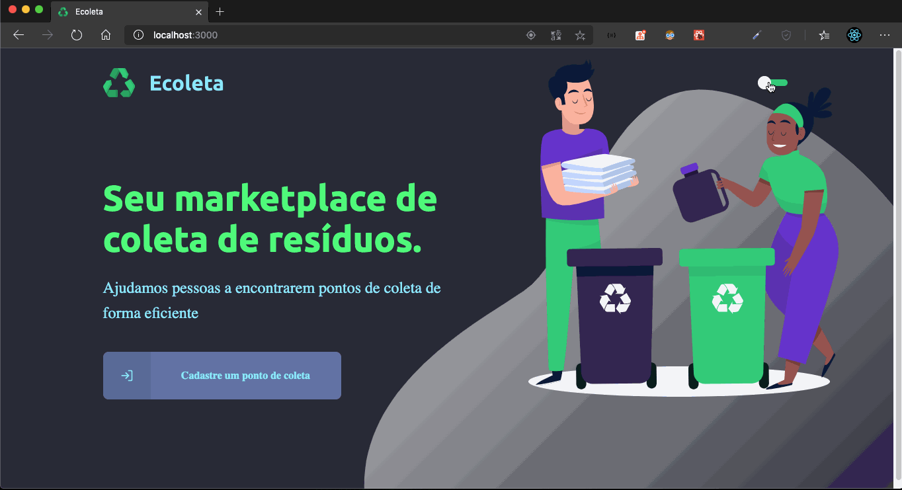

<h4 align="center">
  
</h4>

  
  

# :computer: Web

    

# :iphone: Mobile

  

  

  

# :rocket: Iniciando

### Requisitos

- npm ou yarn
- Expo instalado no celular

### Instalação

- Guia de instalação do [Yarn](https://classic.yarnpkg.com/en/docs/install#mac-stable)
- Guia de instalação do [Node/npm](https://nodejs.org/en/download/package-manager/)
- Baixe este repositório em sua máquina e instale as dependências rodando `$ yarn ` ou `$ npm install` nas pastas backend, frontend e mobile

### Uso

- Para iniciar o back-end rode `$ cd caminho/ate/Ecoleta/server && yarn start`
- Para ver a aplicação web rode `$ cd caminho/ate/Ecoleta/web && yarn start`
- Para ver a aplicação web rode `$ cd caminho/ate/Ecoleta/mobile && expo start` ou o `yarn start`

# :memo: Sobre o projeto
  O Ecoleta é uma aplicação que visa facilitar a coleta de resíduos e assim, diminuir a poluição do nosso planeta.
  Pela aplicação web entidades podem cadastrar um ponto de coleta para os resíduos, na aplicação mobile é possível visualizar esses pontos de coleta e entrar em contato com a entidade que cadastrou ele.

# :computer: Tecnologias Usadas

As seguintes tecnologias utilizadas neste projeto:

- [Node.js](https://nodejs.org/en)
- [Express.js](https://expressjs.com)
- [Knex](http://knexjs.org)
- [ReactJS](https://reactjs.org/)
- [React-Native](https://react-native.dev)
- [Expo.io](https://expo.io/)
- [Typescript](https://www.typescriptlang.org/)

# :muscle: Como contribuir

- Dê um fork no projeto
- Crie uma branch com a sua feature: `git checkout -b my-feature`
- Commit suas mudanças: `git commit -m 'feat: my new feature'`
- Push a sua branch: `git push origin my-feature`